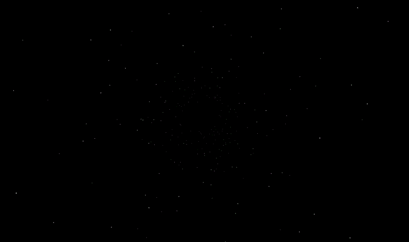

# Starfield Animation

A mesmerizing JavaScript animation that creates the illusion of flying through space. The animation uses HTML5 Canvas to render stars moving outward from the center, creating a dynamic starfield effect that simulates space travel. Features smooth transitions when the window is resized.



## Features

- Smooth star movement with perspective effect
- Dynamic resizing with smooth center transition
- Configurable star parameters via central configuration
- Efficient canvas rendering with bounds checking
- Stars with distance-based transparency
- Responsive design that works on all devices
- Error handling and graceful fallbacks

## Live Demo

[View Live Demo](https://leesykes.github.io/starfield-animation/)

## Installation

1. Clone the repository:

    ```bash
    git clone https://github.com/leesykes/starfield-animation
    ```

2. Open `index.html` in your web browser

Or simply download the files and open `index.html` in your browser.

## Usage

The animation starts automatically when the page loads. No user interaction is required. When you resize the browser window, the starfield smoothly transitions to the new center point.

### Customization

You can modify the animation parameters in `starfield.js` by adjusting the CONFIG object:

```javascript
const CONFIG = {
    STAR_COUNT: 500,        // Number of stars in the field
    MAX_DISTANCE: 1500,     // Maximum Z distance for stars
    MIN_DISTANCE: 10,       // Minimum distance from center
    TRANSITION_SPEED: 0.1,  // Speed of center point transitions (0-1)
    BASE_SPEED: 3,         // Base movement speed of stars
    SPEED_VARIANCE: 2,     // Random variance in star speed
    BASE_SIZE: 0.5,        // Base size of stars
    SIZE_VARIANCE: 1       // Random variance in star size
};
```

### Initialization

The starfield can be initialized by creating a new StarField instance:

```javascript
document.addEventListener('DOMContentLoaded', () => {
    new StarField('starfield');  // Pass the canvas element ID
});
```

## How It Works

The animation creates a 3D effect using the following techniques:

1. **Star Generation**: Stars are created in a ring pattern around the center point
2. **Perspective**: Uses distance-based scaling to create depth perception
3. **Movement**: Stars move outward along their angle while getting larger
4. **Recycling**: Stars are reset to far distance when they reach the screen edge
5. **Smooth Transitions**: Uses linear interpolation to smoothly move stars when the center point changes

### Technical Details

- Uses requestAnimationFrame for smooth animation
- Implements canvas clearing and redrawing each frame
- Handles window resizing with smooth transitions
- Uses alpha transparency for distance effect
- Implements bounds checking for efficient rendering
- Uses object-oriented design with Star and StarField classes
- Centralized configuration for easy customization

## Browser Support

- Chrome (latest)
- Firefox (latest)
- Safari (latest)
- Edge (latest)

## Performance

The animation is optimized for performance but can be adjusted based on your needs:
- Reduce `STAR_COUNT` for better performance on lower-end devices
- Increase `STAR_COUNT` for denser star field on powerful systems
- Adjust `TRANSITION_SPEED` to balance smooth transitions with responsiveness

## Contributing

1. Fork the repository
2. Create your feature branch (`git checkout -b feature/AmazingFeature`)
3. Commit your changes (`git commit -m 'Add some AmazingFeature'`)
4. Push to the branch (`git push origin feature/AmazingFeature`)
5. Open a Pull Request

## License

This project is licensed under the MIT License - see the [LICENSE.md](LICENSE.md) file for details

## Acknowledgments

- Inspired by classic sci-fi space travel effects
- Built with vanilla JavaScript and HTML5 Canvas

## Future Improvements

- [ ] Add color options for stars
- [ ] Implement mouse/touch interaction
- [ ] Add configuration UI
- [ ] Add star trails effect
- [ ] Support for different star shapes

## Troubleshooting

**Q: The animation appears choppy**  
A: Try reducing the `STAR_COUNT` value in the CONFIG object

**Q: Stars are not visible**  
A: Ensure your browser supports HTML5 Canvas and JavaScript is enabled

**Q: Window resize transitions are too fast/slow**  
A: Adjust the `TRANSITION_SPEED` value in the CONFIG object (higher = faster)

**Q: Canvas not found error**  
A: Ensure your HTML contains a canvas element with id="starfield"

## Contact

Lee Sykes - [@gargleb](https://twitter.com/gargleb)  
Project Link: [https://github.com/leesykes/starfield-animation](https://github.com/leesykes/starfield-animation)